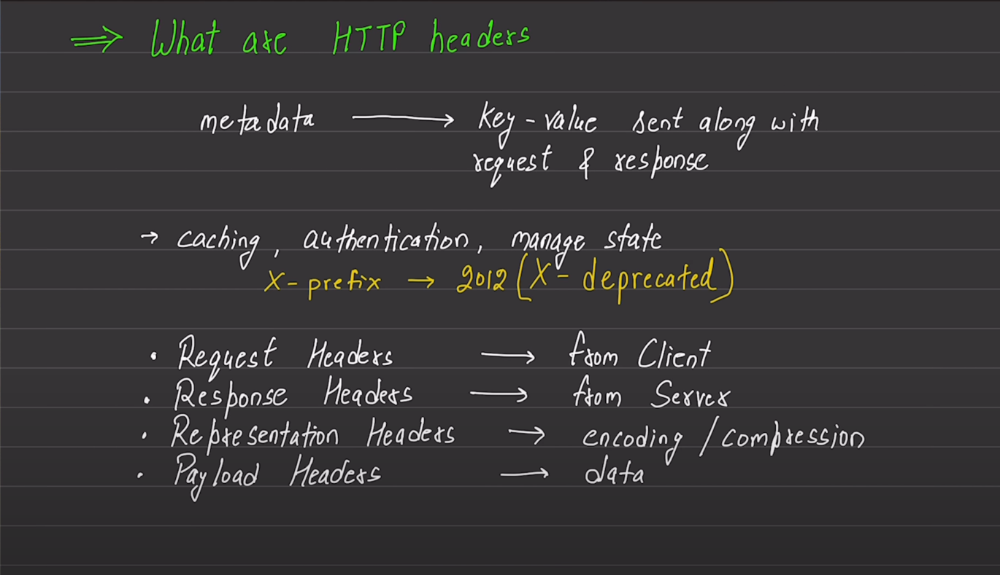
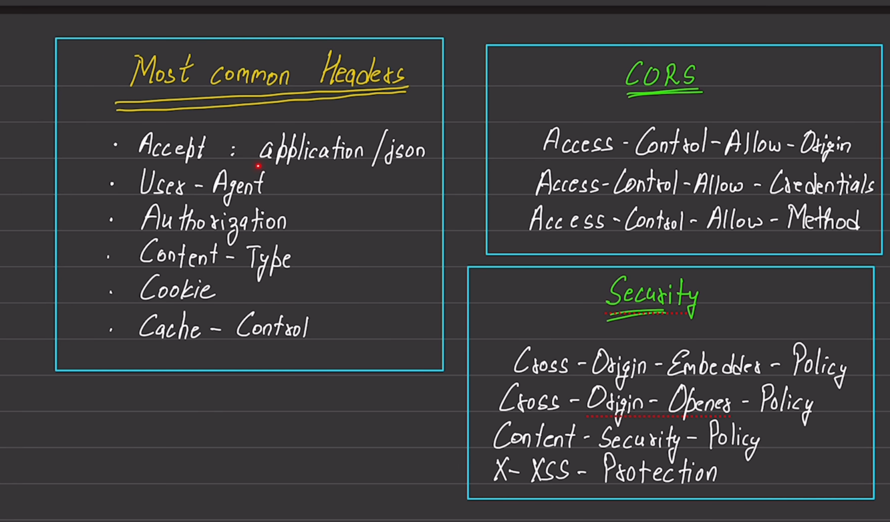
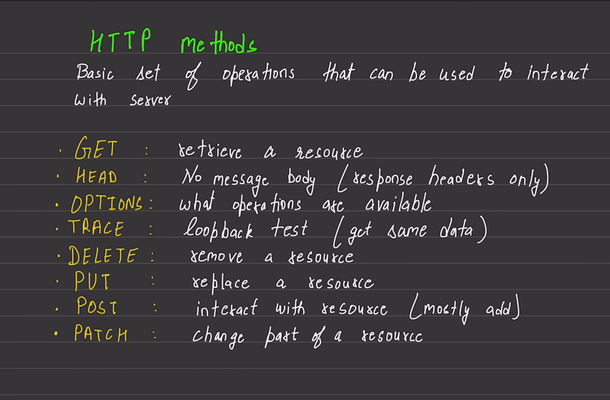

#backend project to understand the approa ch behind the backend projects
 for the http,  

#Refresh token and Access token Difference

Access token is used to authenticate the user and authorize the user to access the protected resources. Access token is short-lived and should be refreshed periodically.

Refresh token is used to obtain a new access token when the current access token expires. Refresh token is long-lived and should be stored securely.

For example:
when a user Login to some website , we tend to to give an access token to the user and it has a expiry time like 15-30 min, can be anything

when the user try to access some protected resource, the server will check the access token and if it
is expired, the server will return an error message.

soo to fix this , like why login again and again and give new token,
soo refresh token came in place, which have a long-lived tokens, and stored in the database,
and then we check if it has that same refresh token, we just then give them new access token to let them in, rather then making them log in again manually

here we are seeing how we can make schema of subsciption 
what we want we will make a new controller which will fetch the profile of the user
and we will see the things like channel name, banner,avatar,channel id,and we want to see the 
number of subscriber they have and the number of subscriptions

we HAVE, SUBSCRIBERS and we have CHANNEL
(both are still users,channel or subscribers both are users)

so whenevr a user will Subscribe to someone, a new document will be created

so for example 
user "a" subscribe to channel "cac"
user "b" subscribe to channel "cac"
user "c" subscribe to channel "cac"
user "c" subscribe to channel "hcc"
user "c" subscribe to channel "fcc"

if we want to find the number of subscribers of the channel
for example: CAC
we will count the document where we have CHANNEL => CAC

and if we want to find the channels the user subscribed
for example: user "c"
we will fetch the channel name in the document document where we have SUBS => C

Aggregation pipelines
Aggregation pipelines are used to perform complex data processing and analysis on large datasets. They are used to aggregate data from multiple collections and perform operations such as grouping, sorting, and filtering.
( a pipeline of condition from which data flows and get filtered and comes out with the data filtered, which has been filtered through stages )

